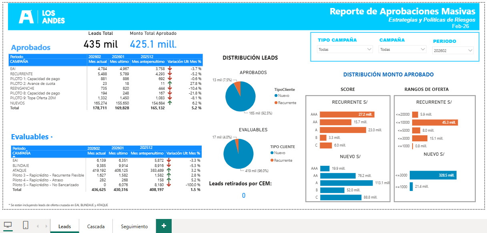
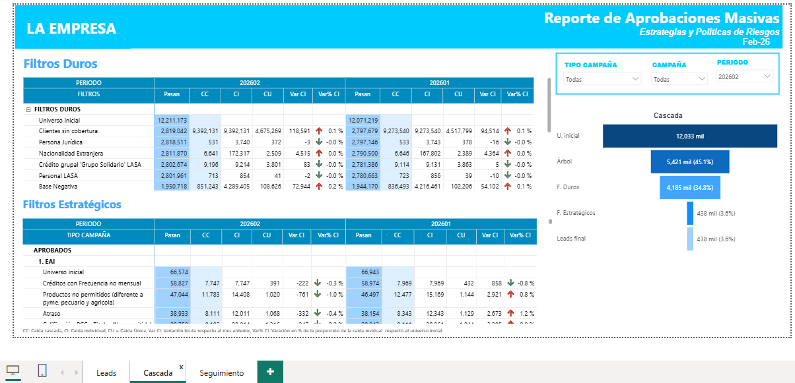
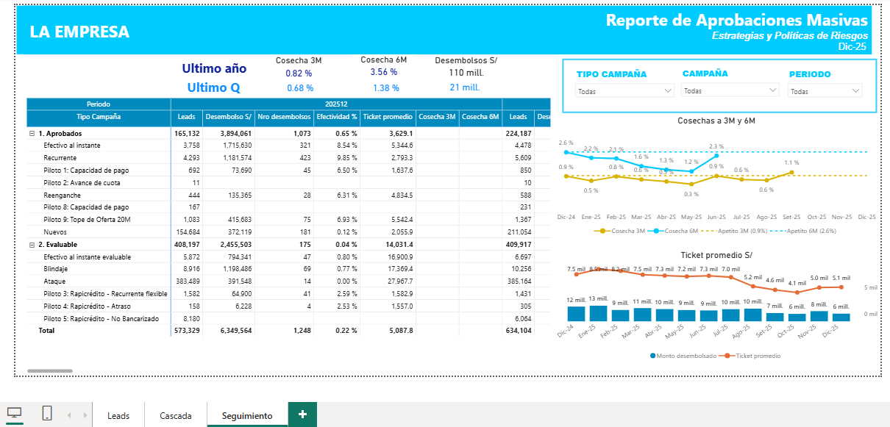

# Credit Campaign Analytics Dashboard

Power BI dashboard built from scratch to replace a manual Excel tracking process,
providing full visibility into the credit campaign approval funnel — from the
initial client universe through hard filters, strategic filters, and final leads —
with cohort-based campaign performance tracking (cosechas 3M and 6M).

## 📸 Dashboard preview

### Leads — Campaign summary


### Cascada — Filter waterfall


### Seguimiento — Cohort tracking


---

## 🎯 Business context

The institution managed multiple monthly credit campaigns (mass approvals and
pre-approvals) across product lines: EAI, Recurrente, Reenganche, and 10+ pilot
campaigns. Previously, the only visibility into campaign performance was a
historical Excel table showing lead counts per campaign — no filter breakdown,
no approval funnel, no cohort tracking.

This solution built the full analytics layer from scratch:

| Before | After |
|--------|-------|
| Manual Excel with lead counts | Interactive Power BI with 3 analytical modules |
| No filter breakdown visible | Full cascade: universe → hard filters → strategic filters → leads |
| No cosecha tracking | Cohort performance at 3M and 6M per campaign |
| Manual monthly update (hours) | Automated with 3 stored procedures + documented process |

---

## 🏗️ Architecture

```
SQL Server (BD_Creditos)
  │
  ├── SP_LEADS_REPORT          ← Normalises campaign data → HAR_LEADS_RESUMEN
  ├── SP_CASCADE_SUMMARY       ← Orchestrates 12+ sub-SPs → BD_CASCADAS_FINALES
  └── SP_CAMPAIGN_TRACKING     ← Tracks cosechas → FCC_SEG_CAMP_REPORTE
          │
          ▼
  Power BI Desktop (.pbix)
  ├── Tab 1: Leads       — Campaign summary (approved leads, amounts, score ranges)
  ├── Tab 2: Cascada     — Filter waterfall (hard filters, strategic filters by campaign)
  └── Tab 3: Seguimiento — Cohort tracking (cosechas 3M/6M, disbursements, effectivity)
          │
          ▼
  Power BI Report Server  (shared with business and risk teams)
```

---

## 📊 Dashboard modules

### Leads
Summary of approved and evaluable leads per campaign, period and product.
Includes KPIs: total leads, total approved amount, distribution by score range,
client type (new / recurring), and offer range.

### Cascada
Waterfall visualisation of the filter pipeline per campaign. Shows how the
initial universe (12M+ clients) is reduced through:
- **Filtros duros:** credit bureau, nationality, group credit, negative base, etc.
- **Filtros estratégicos:** campaign-specific eligibility rules (frequency, arrears,
  product exclusions, etc.)

Enables the risk team to identify which filters have the highest drop-off rate
and adjust campaign policies accordingly.

### Seguimiento
Monthly cohort tracker for approved and pre-approved leads, showing:
- Disbursed amount per campaign
- Effectivity (leads → disbursements conversion rate)
- Cosecha 3M and 6M (write-off ratio at 3 and 6 months post-disbursement)
- Average ticket and disbursement count

---

## 🗄️ Stored procedures

| File | Procedure | Purpose |
|------|-----------|---------|
| `sql/sp_leads_report.sql` | `SP_LEADS_REPORT` | Populates HAR_LEADS_RESUMEN/REPORTE from raw offer data |
| `sql/sp_cascade_summary.sql` | `SP_CASCADE_SUMMARY` | Orchestrates 12+ cascade sub-procedures (2-stage) |
| `sql/sp_campaign_tracking.sql` | `SP_CAMPAIGN_TRACKING` | Builds cosecha tracking table from disbursement + lead data |

### Key design decisions

**Name normalisation in SP_LEADS_REPORT:** Raw campaign names varied across
periods (e.g. `'Piloto 1'`, `'Piloto 1 – Capacidad de Pago'` were different
names for the same campaign). A `CASE WHEN` block with 20+ mappings standardises
all variants to a consistent code before loading — this ensures historical
comparisons remain valid despite campaign naming changes.

**2-stage cascade execution:** `SP_CASCADE_SUMMARY` runs in two stages because
Stage 2 depends on the offer table being populated by the business team after
Stage 1 validation. The split gives the risk team a checkpoint to review
drop-off rates before committing final lead counts.

**Cross-period filter inheritance:** Each month's `MAESTRO_FILTROS` is
initialised by copying the previous month's configuration, then updating only
the filters that changed. This preserves historical comparability while
minimising manual effort.

---

## 🛠️ Tech stack

| Layer | Technology |
|-------|-----------|
| Data processing | SQL Server · Stored Procedures · T-SQL |
| BI & Visualisation | Power BI Desktop · Power BI Report Server |
| Data model | Star schema with HAR (historical) staging tables |
| Documentation | Markdown process guide |

---

## 📋 Monthly process

See [`docs/process_guide.md`](docs/process_guide.md) for the full step-by-step
refresh process, including validation checkpoints and troubleshooting guide.

---

## 📬 Contact

**Ronaldo Chiche Surco**
[LinkedIn](https://linkedin.com/in/ronaldo-chiche) · rchiches@uni.pe
